📚 StudyMate - Your Smart Study Planner App

Welcome to StudyMate, a React Native app designed to help students effectively plan, track, and enhance their study sessions with real-time goal tracking, quizzes, reminders, notes, dark mode, and more.

## 📱 App Screenshots

### 🔐 Login Screen
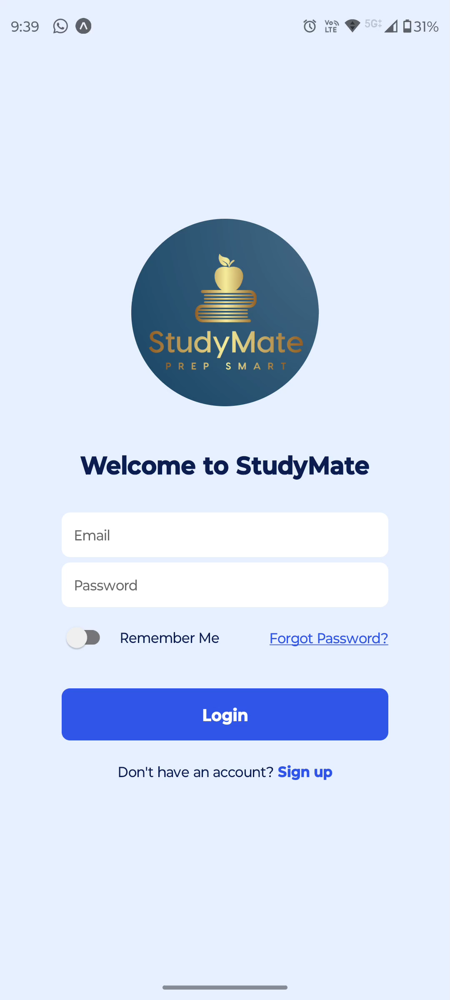

### 🏠 Signup Screen
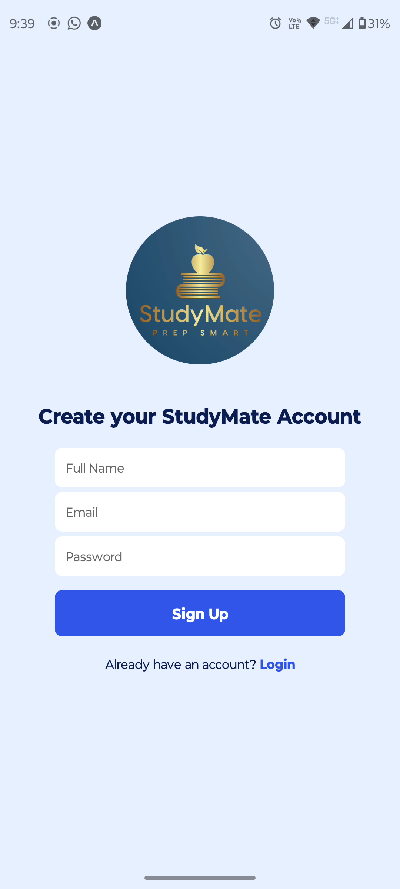

### 🏠 Home Screen
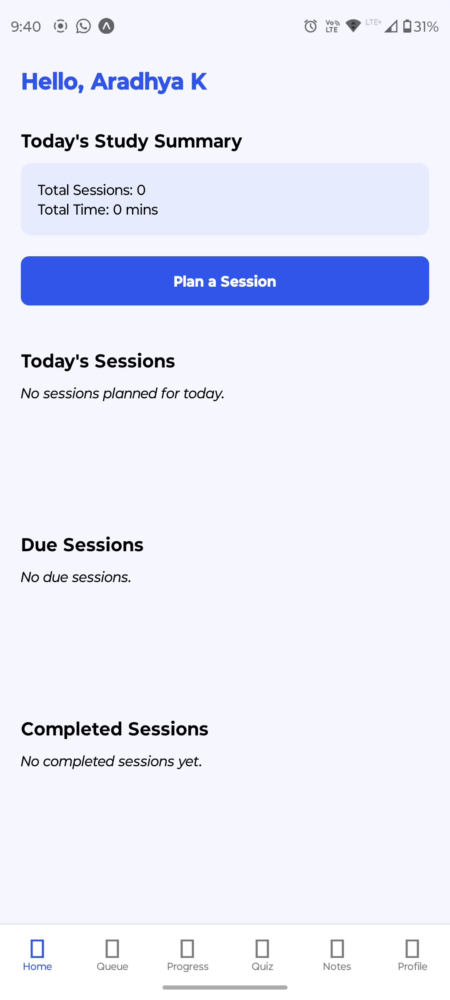

### 🏠 Queue Screen
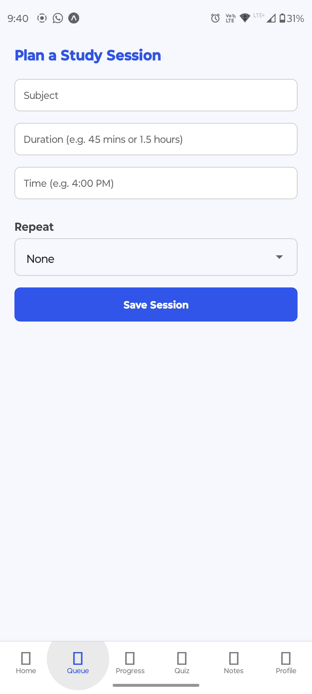

### 🏠 Progress Screen
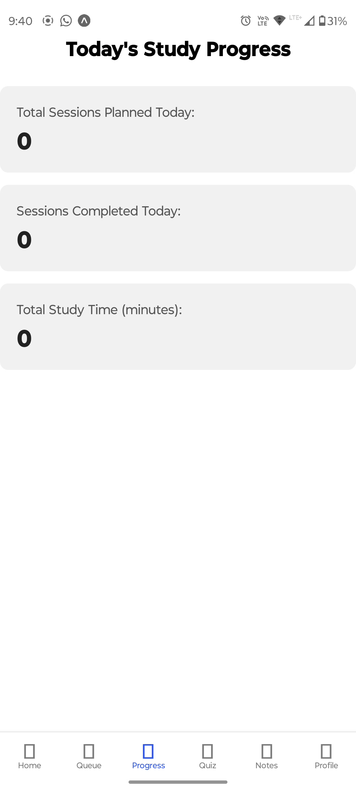

### 🏠 Quiz Screen
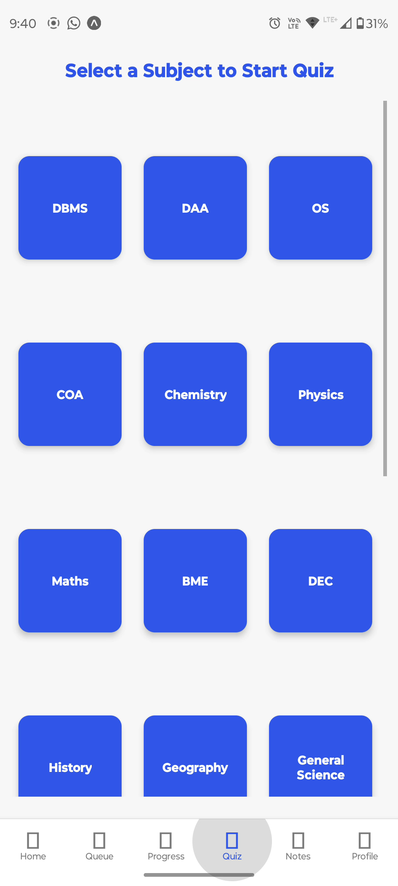

### 🏠 Note Screen
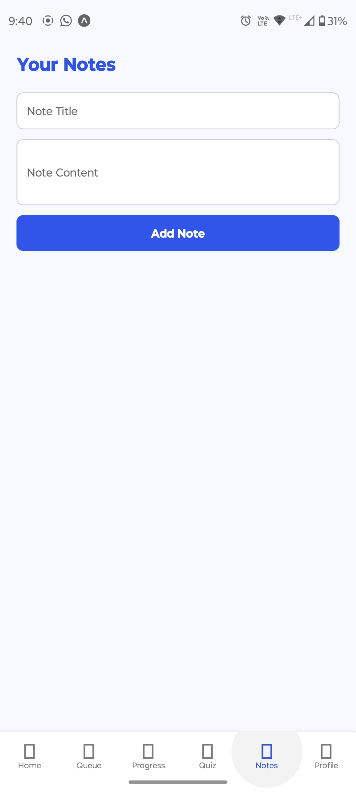

### 👤 Profile Screen
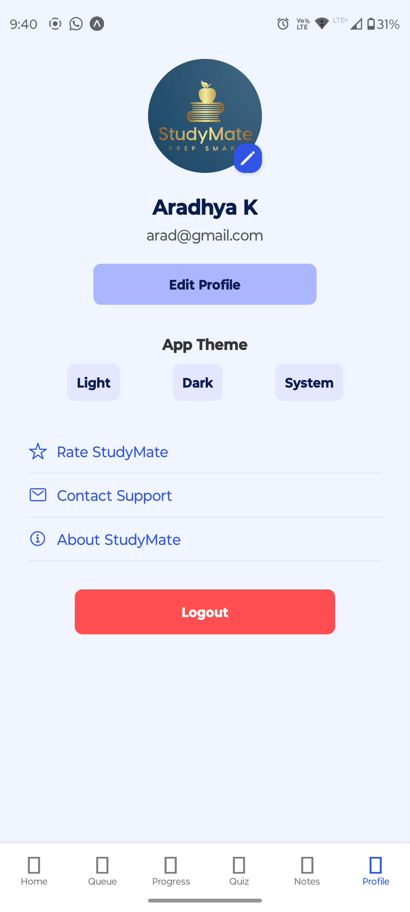

### 🏠 Home Screen
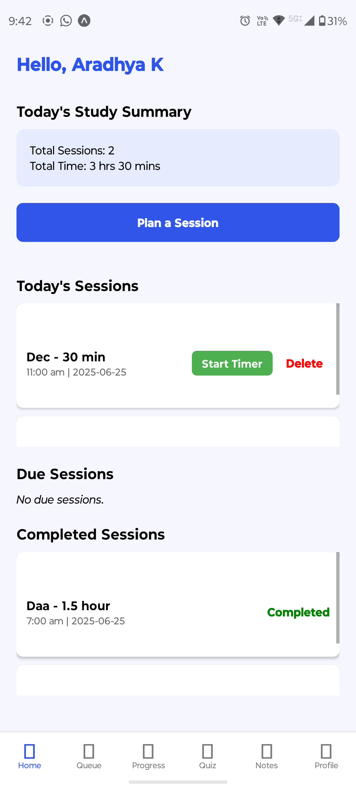

### 🏠 Queue Screen
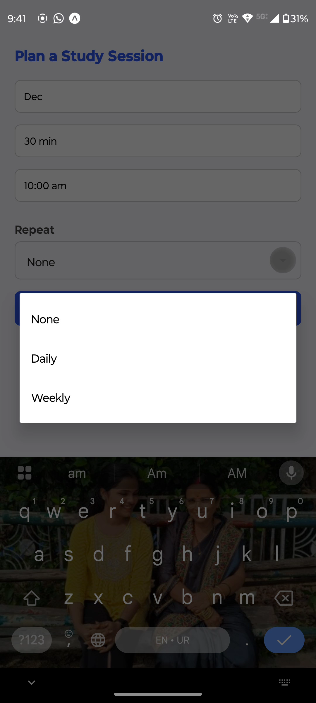

### 🏠 Progress Screen
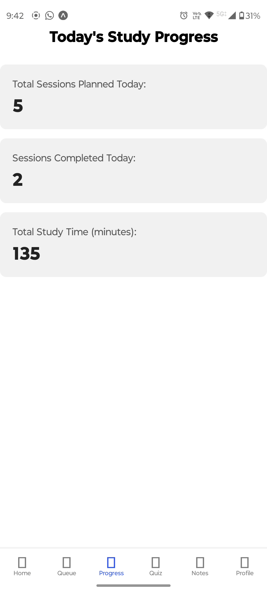

### 🏠 Quiz Screen
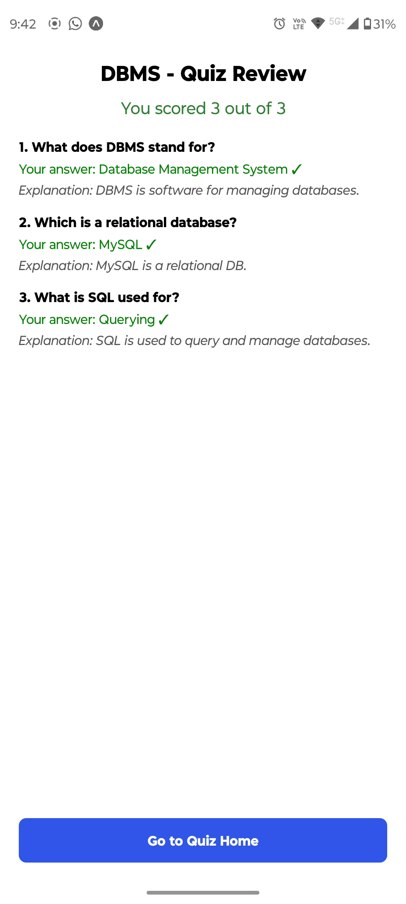

### 🏠 Note Screen
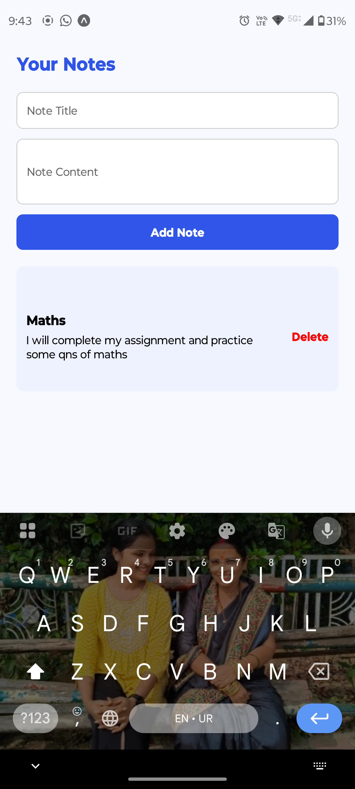

### 👤 Profile Screen
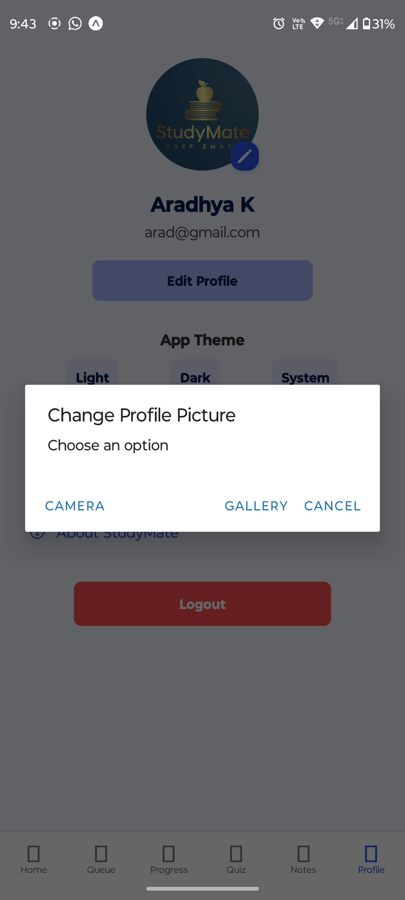

### 👤 Dark mode Screen

## 📽️ App Demo

[▶️ Watch Demo on Google Drive](https://drive.google.com/file/d/1yJqN5N2q02kPBNz45YUfQY7diQAF8dmX/view?usp=sharing)

🚀 Features

✅ Core Features

User Authentication (Login / Signup with local persistence)

Study Session Planner

Daily & Weekly Repeating Sessions

Countdown Timers with Auto Completion

Session Overlap Warnings

Progress Tracker

Daily stats of completed, pending, and overdue sessions

Dark Mode Support

Light, Dark & System Theme toggle

Quiz Mode

Subject-wise MCQs with explanations, scoring, and stats

Notes Section (coming soon)

Reminders

Daily notification for study sessions

Profile Screen

Editable user info

Theme toggle

Options: Rate StudyMate, Contact Support, About

🛠️ Tech Stack

React Native (Expo)

React Navigation

AsyncStorage (for persistence)

Animated Feedback (React Native Animations)

Expo Notifications

📦 Folder Structure

StudyMate/
├── App.js
├── assets/
├── components/
├── context/
│   ├── AuthContext.js
│   └── ThemeContext.js
├── navigations/
│   ├── AppNavigator.js
│   ├── AuthStack.js
│   └── MainTab.js
├── screens/
│   ├── Auth/
│   │   ├── LoginScreen.js
│   │   └── SignupScreen.js
│   ├── HomeScreen.js
│   ├── ProfileScreen.js
│   ├── ProgressScreen.js
│   ├── TimerScreen.js
│   ├── NotesScreen.js (coming soon)
│   └── Quiz/
│       ├── QuizHomeScreen.js
│       ├── QuizPlayScreen.js
│       └── QuizReviewScreen.js
└── utils/
    └── AuthService.js

🖼️ Screenshots

Add screenshots of Home, Progress, Timer, and Quiz screens here

📄 How to Run

npm install
npx expo start

Ensure expo-cli is installed globally. You can run the app on an emulator or Expo Go.

🧪 Sample Login

To test login before signing up:

Email: demo@example.com
Password: demo123

📬 Contact & Support

📧 Email: aradhya.support@email.com

🌐 Website: [coming soon]

⭐ Contributions

If you'd like to contribute, feel free to fork the repo and raise a pull request.

📃 License

MIT License © 2025 StudyMate

